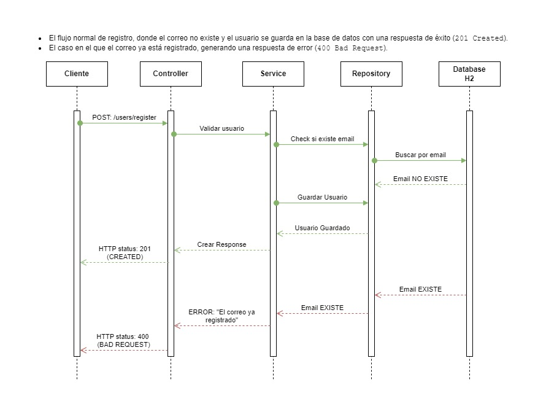

##USER REGISTRATION

#####REGEX de la contraseña

- Como se pidió que sea configurable, agregué una property llamada `validation.password.pattern`.
- Para cambiar la REGEX de la contraseña deberá modificar en el archivo `application.properties` la property `validation.password.pattern` con la REGEX que se quiera utilizar.

#####Para probar la aplicación deberá seguir los pasos siguientes:

1. Clonar el proyecto [https://github.com/emilianocorvi/userregistration.git](https://github.com/emilianocorvi/userregistration.git)    
2. Tener instalado [MAVEN](https://maven.apache.org/download.cgi)
3. Desde PowherShell posicionarse en la raíz del proyecto. En mi caso `C:\Users\...\SmartJob\userregistration>`.
4. Ejecutar el siguiente comando: `mvn spring-boot:run`
5. Ingrese a [swagger-ui](http://localhost:8080/swagger-ui.html).

#####Script DB

- El esquema de la Base de Datos se crea automáticamente al ejecutar la aplicacion.

#####Diagrama

